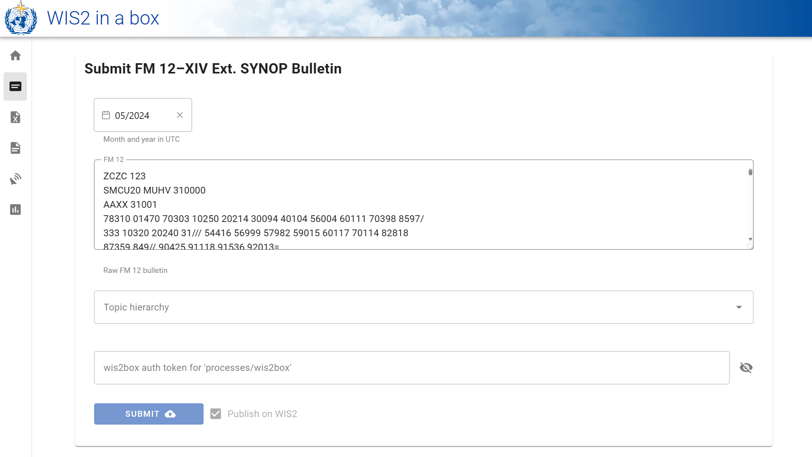
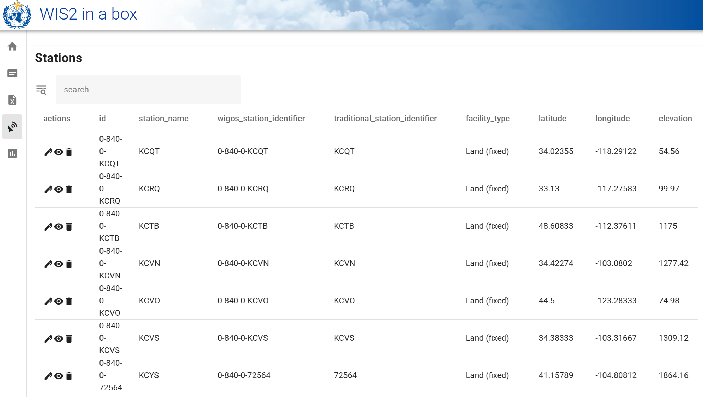
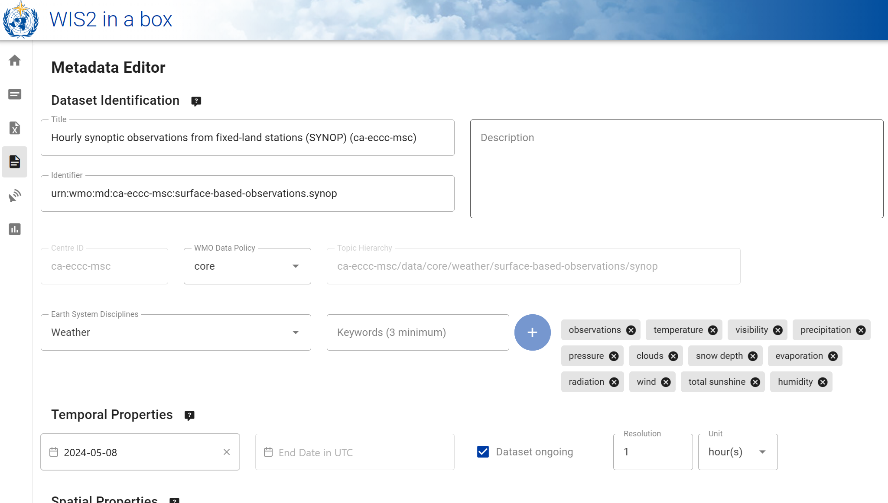
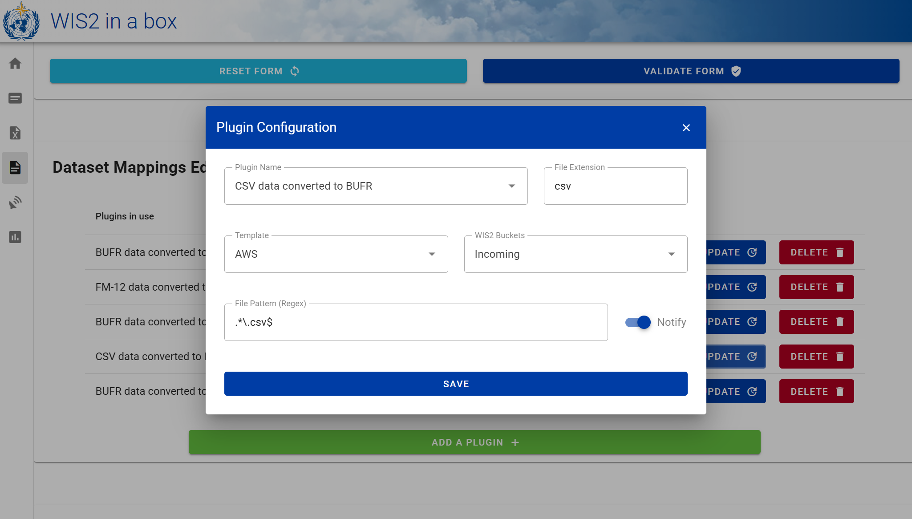
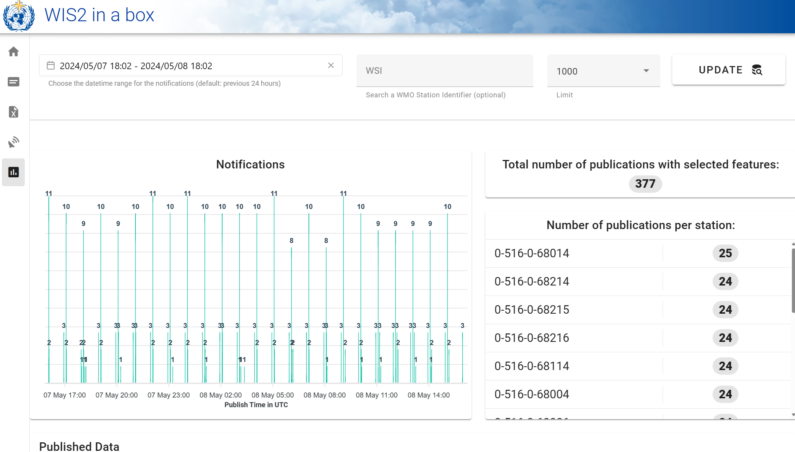
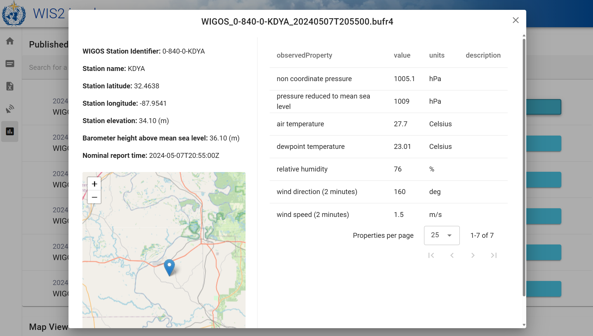
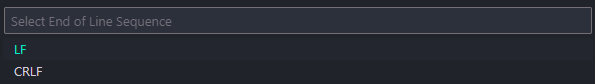

# The wis2box Web App 
### Access the wis2box toolset from your browser.

<div>
    <a href="https://github.com/wmo-im/wis2box-webapp/blob/main/LICENSE" alt="License" ></img></a>
</div>

<br/>

The wis2box Web App is Vue.js application that allows you to publish, edit, and visualise data and metadata from your WIS2 node.

## Features

- **Modern Interface**: Easily navigate the wis2box tools with a user-friendly interface, built with <a href="https://vuetifyjs.com/en/">Vuetify 3</a>.
- **Data Conversion:** Convert your SYNOP or CSV data to the WMO BUFR format and publish in one click.
- **Station Editor:** View, edit, or create new station metadata.
- **Dataset Editor:** Edit or create a new dataset and its associated data plugins.
- **Monitoring:** Visualise and inspect the frequency and origin of the latest data published on your datasets.

## Examples


<div align="center">
    
    
</div>

<br/>

<div align="center">
    
    
</div>

<br/>
    
<div align="center">
    
    
</div>

## Getting Started Locally

### 1. Clone the repository

```bash
    git clone https://github.com/wmo-im/wis2box-webapp
    cd wis2box-webapp
```

### 2. Set the environment variables

Create a file in the root directory named `.env`. Here you can set all of the necessary environment variables to be used. For testing purposes, the most important two are `WIS2BOX_BASEMAP_URL` and `WIS2BOX_BASEMAP_ATTRIBUTION`, for example:

```bash
    WIS2BOX_BASEMAP_URL=https://{s}.tile.openstreetmap.org/{z}/{x}/{y}.png
    WIS2BOX_BASEMAP_ATTRIBUTION=<a href="https://osm.org/copyright">OpenStreetMap</a> contributors
```

You can find an exhaustive list <a href="https://github.com/wmo-im/wis2box-webapp/blob/main/tests/test.env">here</a>.

Now we are ready to start the web app with or without Docker.

### 3. (No Docker) Install npm dependencies and running  

Ensure the following dependencies are installed first:

- [nodejs](https://nodejs.org/en/download/)
- [npm](https://www.npmjs.com/get-npm)

Then, you can run the following commands:

```bash
    npm install
    npm run dev
```
This will start the web app which will be available at http://localhost:8080/wis2box-webapp/

### 3. (Docker) Build the image

In the environment variable file, set the `WIS2BOX_URL`. For example:

```bash
    WIS2BOX_URL=http://localhost:4173
```

Run the following command to build the Docker image:

```bash
    docker build -t wis2box-webapp .
```

Finally, start the Docker container, referencing the environment variables:

```bash
    docker run --env-file .env wis2box-webapp
```

This will start the web app which will be available at your `WIS2BOX_URL`/wis2box-webapp/

*Note: If, on running the Docker container, you receive an error regarding the* `entrypoint.sh` *file, please go to* `docker/entrypoint.sh` *and ensure that the end of line sequence in your IDE is set to **LF**.*

*For example, in Visual Studio Code this can be done by clicking CRLF in the bottom right and then ensuring LF is selected in the drop down at the top of the screen:*



## Testing the wis2box-webapp image as part of the wis2box stack

You can also run the web app as part of your wis2box stack (<a href="https://docs.wis2box.wis.wmo.int/en/1.0b7/">see the wis2box documentation</a>).

To do this, run the following commands:

```bash
    cd tests/
    docker-compose -f docker-compose.yml up -d --build
```

This will start the webapp which will be available at http://localhost:4173/wis2box-webapp/

## Development

### Project setup

#### Install dependencies
```bash
# yarn
yarn

# npm
npm install

# pnpm
pnpm install
```

#### Compiles and hot-reloads for development

```bash
# yarn
yarn dev

# npm
npm run dev

# pnpm
pnpm dev
```

#### Compiles and minifies for production

```bash
# yarn
yarn build

# npm
npm run build

# pnpm
pnpm build
```

### Linting

```bash
# yarn
yarn lint

# npm
npm run lint

# pnpm
pnpm lint
```

### Customize configuration

See [Configuration Reference](https://vitejs.dev/config/).

## Releasing

```bash
# create release (x.y.z is the release version)
vi package.json  # update "version"
vi package-lock.json  # update 'version' and 'packages."".version
git commit -am 'update release version x.y.z'
git push origin main
git tag -a x.y.z -m 'tagging release version x.y.z'
git push --tags

# publish release on GitHub (https://github.com/wmo-im/wis2box-webapp/releases/new)
```

## Bugs and Issues

All bugs, enhancements and issues are managed on [GitHub](https://github.com/wmo-im/wis2box-webapp/issues).

## Contact

* [David Berry](https://github.com/david-i-berry)
* [Rory Burke](https://github.com/RoryPTB)
* [Maaike Limper](https://github.com/maaikelimper)